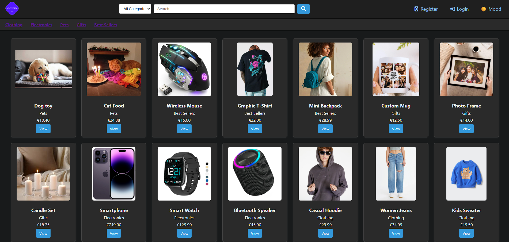

# Webshop Project

---
##  Overview
This project is a **PHP & MySQL-based webshop** built with different access levels for:
- **Visitors** → can browse products
- **Registered users** → can place orders
- **Administrators** → can manage users, products, and shippers  

The system supports **role-based access control**, secure input handling, and a simple, user-friendly interface.

---
## ER Diagram
[Open the PDF](ER-diagram.pdf)
---
##  Features

###  User Management
- User registration & login  
- Roles: `user` and `admin`  
- Admins can:
  - Activate/deactivate users  
  - Change roles (promote/demote admin)  
  - Edit user data  
  - Add new users  

###  Product Management
- View available products  
- Admins can:
  - Add, edit, or delete products  
  - Reactivate products (soft deletion supported via `active` flag)  

###  Orders & Shippers
- Orders are linked to **one shipper**  
- A shipper can handle multiple orders  
- Supports many-to-many relationship between orders and products  
- Tracks product **quantity** in each order  

###  Security
- SQL Injection protection (prepared statements)  
- HTML Injection prevention (sanitizing user input)  
- Error handling with meaningful messages  
- Limited database user (`Webuser` with password `Lab2024`)  

---

##  Database Structure

- **USER**
  - `id`, `username`, `password`, `role`, `active`  

- **PRODUCT**
  - `id`, `name`, `price`, `description`, `active`  

- **SHIPPER**
  - `id`, `name`, `contact_info`, `active`  

- **ORDER**
  - `id`, `user_id`, `shipper_id`, `order_date`  

- **ORDER_ITEMS** (join table)
  - `order_id`, `product_id`, `quantity`  

---

##  Installation

1. Clone the repository into your XAMPP htdocs:

2. Open phpMyAdmin

- Create a new database: webshop

- Import tables.sql

3. Configure database connection:
Update credentials in config.php:

**$dbHost = "localhost"**;
**$dbUser = "Webuser"**;
**$dbPass = "Lab2024"**;
**$dbName = "webshop"]**;

4. Start XAMPP and open in browser:

- http://localhost/webshop
---
 ## Admin Interface

- Toggle user active status

- Change user roles

- Add/edit/remove products

- Manage shippers

- Dark mode & consistent styling
---
## Future Improvements

- Implement payment gateway integration

- Add order tracking for users
---
## Conclusion

This webshop demonstrates a full-stack PHP & MySQL e-commerce system with secure authentication, role-based permissions, and database-driven product and order management. It’s designed to be simple, modular, and easily extendable.
